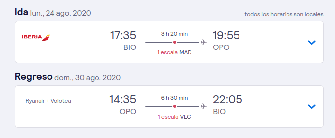

# vacaciones-2020

## Portugal. Oporto

- Total / cabeza: 582 €
- Vuelo: 165 € / cabeza ida + vuelta
  - 
- Alojamiento:
  - [Opción 1](https://es-l.airbnb.com/rooms/24598886?location=Oporto%2C%20Portugal&adults=4&check_in=2020-08-24&check_out=2020-08-30&source_impression_id=p3_1592933383_vMUfvP7K%2Ffg0vr9Q&guests=1) : 469 / 4 = 117 € / persona
  - [Opción 2]([https://es-l.airbnb.com/rooms/35092168?location=Oporto%2C%20Portugal&adults=4&check_in=2020-08-24&check_out=2020-08-30&source_impression_id=p3_1592933393_5MCbukE8riioeayb&guests=1](https://es-l.airbnb.com/rooms/35092168?location=Oporto%2C Portugal&adults=4&check_in=2020-08-24&check_out=2020-08-30&source_impression_id=p3_1592933393_5MCbukE8riioeayb&guests=1)) : 467 / 4 = 116 € / persona
  - [Opción 3](https://es-l.airbnb.com/rooms/17718139?location=Oporto%2C%20Portugal&adults=4&check_in=2020-08-24&check_out=2020-08-30&source_impression_id=p3_1592933406_vRDrPdRNKBYiv9Q%2B&guests=1) : 450 / 4 = 112 € / persona
- Gasto estimado persona / día: 50 * 6 = 300 €

### Madrid

- Total: 474 € / persona
- Viaje Tren vitoria - madrid:  40 € / persona (ida + vuelta)
- Alojamiento:
  - [Opción 1 atocha](https://es-l.airbnb.com/rooms/31954947?location=Madrid&adults=4&check_in=2020-08-24&check_out=2020-08-30&source_impression_id=p3_1592934354_7duc1Q0BeckTS%2Bxp&guests=1) : 535 / 4 = 134 € / persona
  - [Opción 2 chamberí](https://es-l.airbnb.com/rooms/39455977?location=Madrid&adults=4&check_in=2020-08-24&check_out=2020-08-30&source_impression_id=p3_1592934675_94UF%2B7dZOX%2BhCxlM&guests=1) : 471 / 4 =
  - [Opción 3 centro](https://es-l.airbnb.com/rooms/22982876?location=Madrid&adults=4&check_in=2020-08-24&check_out=2020-08-30&source_impression_id=p3_1592934719_eKH3fKuSEG7WkEKv&guests=1) : 582
- Gasto estimado persona / día: 50 * 6 = 300 €

